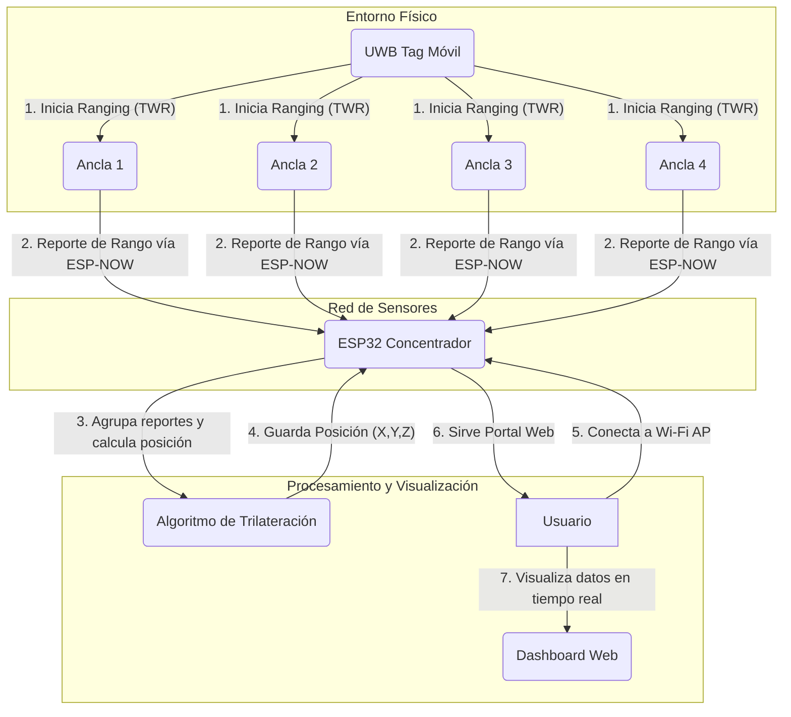

# Concentrador UWB para Sistema de Localización Indoor (TWR)

Este proyecto implementa el firmware para un dispositivo ESP32 que actúa como el servidor central o **concentrador** de un sistema de localización en tiempo real (RTLS) basado en tecnología UWB (Ultra-Wideband).

El sistema utiliza un método de **Trilateración** basado en **Two-Way Ranging (TWR)**. Las anclas miden su distancia a un tag móvil y reportan esta información al concentrador, que calcula la posición 3D del tag y la expone a través de un portal web.

## 📋 Características Principales

- **Recepción de Múltiples Anclas:** Recibe datos de 3, 4 o más anclas UWB de forma inalámbrica.
- **Comunicación Eficiente:** Utiliza el protocolo **ESP-NOW** para una comunicación de baja latencia y alto rendimiento entre las anclas y el concentrador.
- **Cálculo de Posición 3D:** Implementa un algoritmo de **Trilateración por Mínimos Cuadrados** para determinar la posición (X, Y, Z) del tag a partir de las distancias medidas.
- **Portal Web Integrado:** Levanta un Punto de Acceso Wi-Fi y sirve un panel de control web para visualizar en tiempo real:
    - La posición calculada del tag.
    - Una tabla con los reportes de todas las anclas activas (distancia, calidad de señal, etc.).
- **Arquitectura Modular:** El código está organizado en clases con responsabilidades claras (`PositioningManager`, `PortalWeb`), facilitando su mantenimiento y expansión.
- **Estructuras de Datos Optimizadas:** Utiliza estructuras de datos (`struct`) empaquetadas (`#pragma pack`) y enteros con escala para minimizar el tamaño de los paquetes de red.

---

##  diagrama Funcional

El siguiente diagrama ilustra el flujo de datos y la interacción entre los componentes del sistema:



---

## ⚙️ Tecnología y Funcionamiento

### Stack Tecnológico

- **Hardware:** ESP32 (para el concentrador y las anclas), Módulos UWB (ej. Decawave DWM1000/DWM3000).
- **Framework:** PlatformIO con Arduino.
- **Protocolos de Comunicación:**
    - **UWB (IEEE 802.15.4):** Para la medición de distancia precisa (ranging) entre el tag y las anclas.
    - **ESP-NOW:** Para la comunicación inalámbrica de backhaul entre las anclas y el concentrador. Se eligió por su baja latencia y por no requerir una red Wi-Fi tradicional.
    - **Wi-Fi (Modo AP):** Para que el usuario pueda conectarse directamente al concentrador y ver el portal web.
- **Librerías Principales:** `ESPAsyncWebServer`, `ArduinoJson`.

### Arquitectura del Software

El proyecto está estructurado de forma modular para separar las responsabilidades:

- `src/main.cpp`: Punto de entrada. Configura e inicializa todos los módulos (WiFi, ESP-NOW, Portal, Manager de Posición).
- `include/DataUtils.h`: Define las estructuras de datos para la comunicación (`AnchorRangeReport_t`) y para el uso interno (`DecodedAnchorReport_t`). Contiene las funciones de empaquetado y desempaquetado de datos, aplicando optimizaciones como el escalado de enteros.
- `include/PositioningManager.h` y `src/PositioningManager.cpp`: El cerebro del sistema. Esta clase recibe los reportes de las anclas, los agrupa por número de secuencia y, cuando tiene suficientes, ejecuta el algoritmo de trilateración para calcular la posición del tag.
- `include/PortalWeb.h` y `src/PortalWeb.cpp`: Encapsula toda la lógica del servidor web, incluyendo el código HTML, CSS y JavaScript del panel de control.

### Flujo de Operación

1.  El **Tag** inicia un proceso de TWR con todas las anclas a su alcance.
2.  Cada **Ancla** calcula su distancia al tag y obtiene datos de los sensores del tag.
3.  El ancla empaqueta toda esta información en una `struct AnchorRangeReport_t` y la envía al concentrador usando ESP-NOW.
4.  El **Concentrador** recibe el paquete. La función `OnDataRecv` se dispara, desempaqueta los datos y los pasa al `PositioningManager`.
5.  El `PositioningManager` almacena los reportes, agrupándolos por el `seq` (número de secuencia). Si recibe suficientes reportes (mínimo 3 o 4) para la misma secuencia, invoca al algoritmo de cálculo.
6.  El algoritmo de trilateración resuelve la posición y el `PositioningManager` guarda el resultado.
7.  Paralelamente, el **Portal Web** está activo. Un usuario conectado a la red Wi-Fi del concentrador puede ver una página que, cada 2 segundos, solicita los últimos datos al ESP32.
8.  El ESP32 responde con la última posición calculada y una lista de los últimos reportes de cada ancla, que se muestran en la interfaz.

---

## 🚀 Configuración y Uso

### Requisitos

- Visual Studio Code con la extensión de PlatformIO.
- Un ESP32 para el concentrador.
- Al menos 3 anclas basadas en ESP32+UWB programadas para enviar reportes `AnchorRangeReport_t`.

### Pasos de Configuración

1.  Clona este repositorio.
2.  Abre la carpeta del proyecto con VSCode.
3.  PlatformIO instalará automáticamente las dependencias (`ESPAsyncWebServer`, etc.).
4.  **¡CONFIGURACIÓN CRÍTICA!** Abre el archivo `src/main.cpp` y modifica las siguientes líneas con las coordenadas 3D **reales** (en metros) y los **ID cortos** de tus anclas físicas:
    ```cpp
    // !!! TAREA CRÍTICA: CONFIGURAR POSICIONES DE LAS ANCLAS !!!
    manager.setAnchorPosition(0x1001, 0.0, 0.0, 2.5);
    manager.setAnchorPosition(0x1002, 5.0, 0.0, 2.5);
    manager.setAnchorPosition(0x1003, 5.0, 5.0, 2.5);
    manager.setAnchorPosition(0x1004, 0.0, 5.0, 2.5);
    ```
5.  Construye (`Build`) y sube (`Upload`) el proyecto a tu ESP32.

### Uso

1.  Alimenta el ESP32 concentrador y las anclas.
2.  Desde tu PC o móvil, conéctate a la red Wi-Fi con el nombre (SSID) **`ESP32-Concentrador`** y la contraseña **`123456789`**.
3.  Abre un navegador web y ve a la dirección `http://192.168.4.1`.
4.  El portal mostrará la posición calculada y los datos de las anclas en tiempo real a medida que lleguen.
